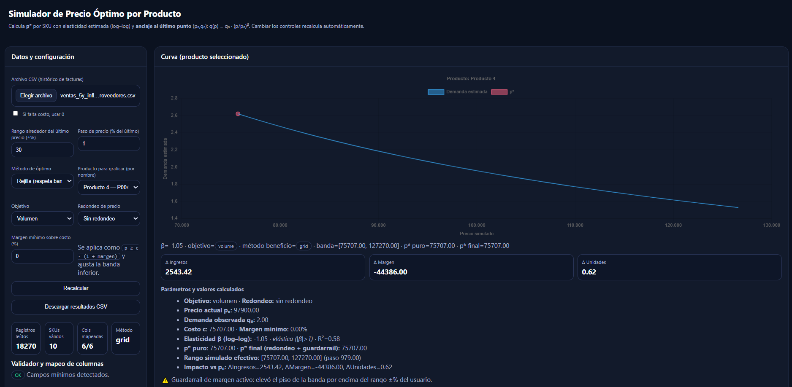

# Simulador de Precio Óptimo (HTML standalone)

**Archivo:** `simulador_precio_optimo_local_alphav0.html`

Este proyecto consiste en una aplicación web de una sola página (SPA) construida con HTML + CSS + JavaScript, completamente auto-contenida. Diseñada para funcionar localmente sin instalaciones, esta herramienta permite simular precios óptimos por SKU a partir de historiales de ventas.





## Características destacadas

* **Carga de CSV** flexible (encabezados variables)
* Estimación de **elasticidad precio-demanda** mediante regresión logarítmica
* Tres objetivos de optimización:

  * Maximizar **beneficio**
  * Maximizar **ingresos**
  * Maximizar **unidades vendidas**
*  **Algoritmo mixto**:

  * Rejilla de simulación (rango personalizable sobre el último precio)
  * Cálculo directo con la **fórmula de Lerner**, si aplica
* **Restricción de margen mínimo** y opciones de **redondeo comercial** (.99 o .95)
* Curvas interactivas de precio vs. unidades, ingresos y margen
* Visualización por fecha y exportación de resultados a CSV
* Análisis multi-SKU con resumen consolidado


##  Uso

1. **Abrir el HTML** localmente con doble clic (modo `file://`)
2. Hacer clic en **"Archivo CSV"** para subir el historial de ventas
3. Asignar manualmente los campos obligatorios:

   * `product_id`, `price`, `quantity`
   * Opcionales: `cost`, `product_name`, `date`
4. Seleccionar el producto a analizar
5. Configurar la simulación:

   * Banda de precios (±% sobre el último precio)
   * Paso de la rejilla
   * Objetivo de optimización
   * Redondeo y margen mínimo
6. Revisar resultados y descargar el CSV


## Tecnologías

* HTML5, CSS3, JavaScript vanilla
* [PapaParse](https://www.papaparse.com/) para parseo de CSV (vía CDN)
* [Chart.js](https://www.chartjs.org/) para gráficos interactivos (vía CDN)

No requiere backend, frameworks ni instalaciones adicionales. Todo está empaquetado en un solo archivo.


## Ejemplo de entrada CSV

```csv
date,product_id,product_name,price,quantity,cost
2024-01-01,P001,Producto 1,1200,45,900
2024-01-02,P001,Producto 1,1250,40,900
...
```


## Exportaciones

* Archivo CSV con resultados por SKU:

  * Precio actual vs. precio óptimo
  * Elasticidad β
  * R² de la regresión
  * Ingresos, margen y unidades esperadas
  * Variaciones relativas (delta %) vs. precio actual


## Licencia

MIT. Uso libre para fines educativos, comerciales o personales. Agradecimientos si compartes mejoras o retroalimentación.


## Autor

Desarrollado por un científico de datos senior, como demostración de lo que se puede construir con **prompt engineering** e ingeniería de interfaces simples. Diseñado para ejecutarse sin dependencias, sin instalar nada, y entendible incluso para usuarios no técnicos.

